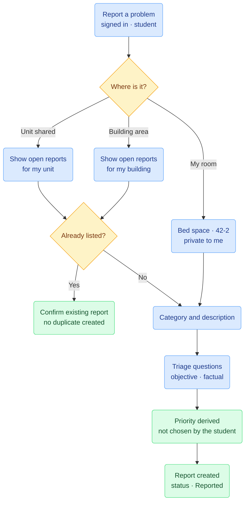
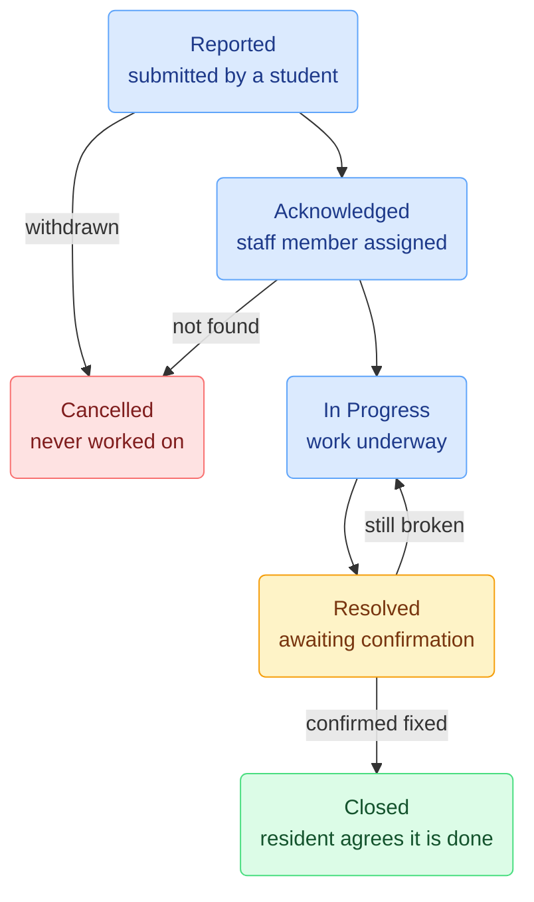
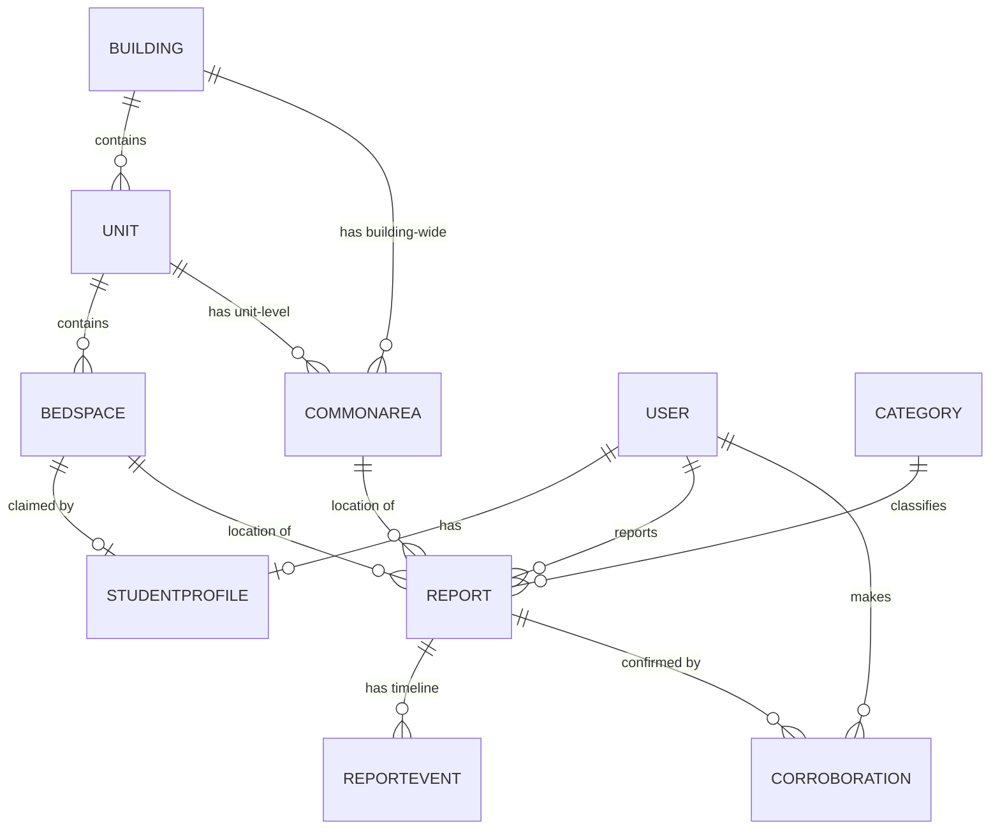

# ResFix — Student Residence Maintenance Reporting System
A Django web application for reporting and tracking maintenance issues in student residences.

**Full-Stack Django Project — Deliverables 1 and 2**<br>
**Author:** Ethan Smith<br>
**Date:** 18 August 2026<br>

# Use Case<br>

**Version:** 1.1<br>
**Status:** Approved

> **1.1** — Registration changed from selecting a bed space to entering a claim code
> issued at check-in. The previous design required the registration page to display
> unoccupied bed spaces, which would have published which rooms in the residence are
> empty. See section 5.

---

## 1. Background and Problem Statement

This use case is based on a problem observed first-hand in a student residence.
Maintenance issues were reported by walking to the reception desk and describing the
problem to a staff member, who wrote it down. This process failed in four ways:

1. **Reception became a bottleneck.** Reports could only be made during office hours,
   and at busy times students queued to report a dripping tap.
2. **Problems went unreported entirely.** Faced with the effort of queuing, students
   frequently decided a problem was not worth reporting — including problems that
   genuinely mattered.
3. **Duplicate reporting wasted staff time.** A single broken light in a shared
   corridor would be reported separately by many residents, each generating a separate
   piece of paper, with no way to tell they were the same fault.
4. **Urgent issues were not distinguishable from routine ones.** A broken ground-floor
   window that would not lock was recorded in the same way as a slow-draining sink.
   The first is a security and safety risk to the whole building; the second is an
   inconvenience.

The fourth failure is the most serious. Unreported or under-prioritised faults in a
residential building are not merely inconvenient — broken locks, faulty electrics and
water damage carry real risk to residents and to the building itself.

ResFix replaces the reception desk process with a web application. Students report
faults directly, at any hour, and follow progress themselves. Maintenance staff work
from a single prioritised queue that makes urgent work visible.

## 2. Business Objectives

| # | Objective | How the system achieves it |
|---|---|---|
| 1 | Remove the reception bottleneck | Students report directly online, 24/7 |
| 2 | Increase reporting rate for minor faults | Reporting takes under a minute, lowering the effort barrier |
| 3 | Surface genuinely urgent work | Priority is derived from objective questions, not self-assessment |
| 4 | Eliminate duplicate reports for shared areas | Residents corroborate an existing report instead of creating a new one |
| 5 | Route work correctly | Structured category and location data make the staff queue sortable |
| 6 | Give residents visibility of progress | Staff updates are published back to the reporter |
| 7 | Create an auditable maintenance record | Every report, update and priority change is stored with a timestamp |

## 3. Residence Structure

Student residences are not a flat list of rooms. Accommodation is organised into
units: a unit may be a single room with one occupant, or a shared flat in which each
resident has a private bed space but the kitchen, lounge and bathroom are shared
between them. Beyond the units are areas used by the whole building.

ResFix models this in four levels:

| Level | Description | Example |
|---|---|---|
| Building | A residence block | Building A |
| Unit | A room or flat within a building | Unit 42 |
| Bed space | One resident's private space within a unit | 42-1, 42-2, 42-3 |
| Common area | A shared space, belonging either to one unit or to the whole building | Unit 42 kitchen; ground floor laundry |

### 3.1 The bed space identifier

The residence already issues each resident an identifier of the form
`<unit>-<occupant>` — a student in the second bed space of unit 42 is 42-2. This
identifier is adopted directly by ResFix, for three reasons:

- It is already familiar to residents and to residence administration.
- It is unique to one person, so it identifies a resident unambiguously. "Room 42"
  does not, if four people live there.
- It gives maintenance staff a precise destination. A fault in 42-2 is in a specific
  private room, not somewhere in a shared flat.

### 3.2 Common areas

A common area belongs either to a single unit or to the building as a whole. A unit
kitchen is shared by that unit's residents only. A laundry room is shared by every
resident of the building. This distinction determines who may see and corroborate a
report, as described in section 6.

## 4. Actors

The system has **two roles** with distinct capabilities and separate dashboards.

### 4.1 Student (standard user)
A resident of the building. Self-registers an account and claims their bed space
during registration. Reports faults, tracks their own reports, and corroborates
reports for shared areas they have access to. Never sees a report made from inside
another student's private bed space.

### 4.2 Maintenance Staff (administrative user)
An employee of the residence. Accounts are created by the system administrator, not
self-registered. Sees every report across every building, adjusts priority, assigns
work, posts updates and resolves reports. Also maintains the residence structure —
buildings, units, bed spaces and common areas — through the administration interface.

## 5. Registration and Bed Space Assignment
 
A student's account must be tied to the correct bed space. If it is not, maintenance
staff are sent to the wrong room, and — more seriously — one student's reports could
become visible to another.
 
**Registration requires a claim code issued by reception.** When a student is given
the keys to their room, they are also given a short code that belongs to that bed
space and no other. Registration asks for a username, a password and that code. The
building, unit and bed space are all determined by the code; the student selects
nothing and types no room number.
 
This mirrors how the residence this use case is based on already works. Residents
were issued account codes at reception when they were first allowed into their rooms,
alongside their keys and electricity account details. Adopting the same process means
the system fits an existing procedure rather than requiring a new one.
 
### 5.1 Why not selection from a list
 
An earlier version of this design offered three dependent dropdowns — building, then
unit, then bed space — populated from the database. That approach was rejected on
security grounds.
 
To be usable, the bed space dropdown would have to list **unoccupied** bed spaces. The
registration page is public and requires no account to view. The result would be a
publicly readable list of which rooms in a residential building are currently empty.
 
That directly contradicts section 6.2, which restricts what the system will disclose about
individual rooms precisely because such information assists anyone intending to target
one. A system that hides which room has a broken lock, while publishing which rooms
are unoccupied, has not solved the problem.
 
The claim code removes the disclosure entirely. The registration page reveals nothing
about the residence: not how many buildings exist, not how many rooms, not which are
occupied.
 
### 5.2 Properties of the code
 
- **Issued in person.** Reception hands the code over at check-in, alongside the keys.
- **Unique to one bed space.** No two bed spaces share a code.
- **Single use.** Once an account is linked to a bed space, that code cannot be used
  again. This is enforced at the database level by the one-to-one relationship between
  a student profile and a bed space.
- **Not guessable.** Codes are randomly generated, not sequential, so knowing one code
  reveals nothing about any other.
- **Readable aloud.** Characters that are easily confused in speech or print are
  excluded from the alphabet.

### 5.3 Failed registration
 
If a code is not recognised, or belongs to a bed space that is already claimed, the
student is told the code is not valid and directed to reception. **The same message is
shown in both cases.** Distinguishing between "no such code" and "already used" would
confirm to someone entering codes at random when they had found a real one.

## 6. Report Visibility and Corroboration

### 6.1 Three tiers of visibility

Visibility follows directly from where a fault is located.

| Location of fault | Visible to | May be corroborated by |
|---|---|---|
| A student's bed space | That student and staff only | Nobody |
| A unit common area | The residents of that unit, and staff | Residents of that unit |
| A building common area | All residents of that building, and staff | Residents of that building |

### 6.2 Restriction on private reports

Reports logged against a bed space are **never** visible to any student other than the
reporter.

This is a safety decision, not only a privacy one. A feed that included bed space
faults would publish which rooms currently have a broken lock, a window that will not
close, or a door that does not latch — information that would materially assist anyone
intending to target a room. The restriction is absolute and is not relaxed for
flatmates.

### 6.3 Preventing duplicates

Rather than allowing duplicate reports to be created and then merged by staff, ResFix
prevents duplicates at the point of creation.

When a student begins reporting a fault in a common area, the system first shows the
open reports already logged for the areas that student has access to. If the fault is
already listed, the student selects "I have this problem too" instead of submitting a
new report. Each student may corroborate a given report only once, enforced at the
database level.

The corroboration count is displayed to staff. Where a report accumulates
corroborations beyond a defined threshold, its priority is escalated automatically.
**Corroboration can only raise a priority, never lower one**, so that volume of
reporting can never be used to suppress a safety-critical fault.

There is no mechanism for students to dispute or downvote another student's report. An
unresolved hazard must not be capable of being voted into invisibility. A report may be
withdrawn only by its original reporter, or closed by staff as not found.

## 7. Priority Determination

### 7.1 Design rationale

A conventional design would let the reporter choose a priority from a dropdown. This
was rejected because it fails in both directions: a student may inflate the priority of
a minor fault to jump the queue, and — more dangerously — may under-report a serious
fault because they do not recognise it as serious.

ResFix therefore does not ask the student how urgent the problem is. It asks a short
set of **objective, factual questions**, and derives the priority from the answers.

This has two effects. Inflating priority now requires making a specific factual claim
that a technician will disprove on arrival, which is a meaningfully stronger deterrent
than moving a slider. And a student who does not realise that a burning smell is
serious does not need to — the system escalates on their behalf.

### 7.2 Triage questions

| Question | Effect |
|---|---|
| Is water currently running, leaking or flooding? | Yes → escalate to High |
| Can the affected door or window still lock securely? | No → escalate to Emergency |
| Is there a burning smell, sparks, or visible exposed wiring? | Yes → escalate to Emergency |
| Is the room still usable for sleeping tonight? | No → escalate to High |

### 7.3 Priority levels

| Priority | Target response | Typical example |
|---|---|---|
| Emergency | Immediate | Exposed wiring; external door will not lock |
| High | Same day | Active leak; room uninhabitable |
| Standard | Within 3 working days | Broken appliance; faulty interior light |
| Low | Next scheduled maintenance | Slow-draining sink; loose cupboard handle |

Each category carries a minimum priority. Electrical faults and any fault affecting
building security cannot be recorded below High, regardless of the triage answers.

### 7.4 Staff override

Maintenance staff may raise or lower the priority of any report. The system stores both
the originally derived priority and the current priority, together with the identity of
the staff member who changed it and the time of the change. This override requires no
site visit — it is a single action on the dashboard.

## 8. Scope

### 8.1 In Scope

**A student can:**
- Register an account using a claim code issued by reception, then log in and
  out
- Report a fault, following the three-step flow: where, what, and detail
- Corroborate an existing report for a shared area they have access to
- View a list of their own reports and their current status
- View the full history of staff updates on one of their reports
- Confirm that a resolved fault is genuinely fixed, or return it as still broken
- Withdraw their own report

**Maintenance staff can:**
- Log in to a staff dashboard listing every report
- Filter and sort the queue by priority, status, category, building and corroboration
  count
- Assign a report to themselves
- Raise or lower the priority of a report, with the change attributed and timestamped
- Post an update against a report, visible to the reporter and to anyone who
  corroborated it
- Move a report through the workflow and mark it resolved
- Close a report as not found
- Maintain the residence structure and the category list through the administration
  interface

### 8.2 Out of Scope
 
Excluded to keep the project deliverable within the available time. Recorded as
possible future enhancements.

- Reissuing a claim code when a room changes occupant at the end of a lease
- Rate limiting or lockout after repeated failed registration attempts
- Photograph upload (requires external media storage to survive redeployment)
- Email or SMS notification of status changes
- A third role for a residence manager with oversight and reporting dashboards
- Contractor scheduling, parts ordering and cost tracking
- Statistical reporting on response times and recurring faults
- Serving multiple residences from a single deployment. Each residence currently runs
  its own instance with its own database, which makes isolation structural rather than
  dependent on correct filtering in application code.
  
## 9. Reporting Flow



A student reporting a fault answers three questions in sequence.

**Step 1 — Where is the problem?**
- In my own room — the student's bed space, already known to the system
- In a shared space in my unit — offered only to residents of a shared unit
- In a building area — laundry, gym, study centre, corridor, communal bathroom

If a common area is selected, the system displays open reports for that area before
allowing a new one, as described in section 6.3.

**Step 2 — What is the problem?**
The student selects a category (plumbing, electrical, appliance, structural, furniture,
pest, other) and then, where applicable, the specific fixture — offered from a list
filtered by the chosen category and the type of location.

**Step 3 — Describe it.**
A free-text description, followed by the triage questions from section 7.2.

Structured selection in steps 1 and 2 is what makes the staff queue sortable and
routable. The free-text description in step 3 captures what the structured fields do
not anticipate. Both are required.

## 10. Report Workflow



| Status | Meaning |
|---|---|
| Reported | Submitted by a student; no staff member has picked it up |
| Acknowledged | A staff member has assigned the report to themselves |
| In Progress | Work is underway |
| Resolved | Staff consider the work complete; awaiting student confirmation |
| Closed | Student has confirmed the fault is fixed; the report is complete and no longer actionable |
| Cancelled | Withdrawn by the reporter before work began, or closed by staff as not found |

The student confirmation step is deliberate. It prevents a report being marked complete
when the underlying fault persists, and it gives the resident the final say on whether
their problem was actually solved. Where a report has corroborations, confirmation by
the original reporter closes it.

## 11. Use Case Narratives

### UC-01 — Student registers using a claim code
 
- **Actor:** Student
- **Precondition:** The residence structure has been loaded by staff, and the student
  has been issued a claim code by reception
- **Main flow:**
  1. Student opens the registration page and enters a username and password
  2. Student enters the claim code issued to them
  3. System looks up the bed space holding that code
  4. System creates the account and links it to that bed space
  5. Student is logged in and taken to their reports page
- **Alternate flow:** If the code is not recognised, or its bed space is already
  claimed, registration is refused with a message stating the code is not valid and
  directing the student to reception. The two cases are not distinguished.
- **Postcondition:** The student is associated with exactly one bed space, and the
  code cannot be used again

### UC-02 — Student reports a fault in their own room

- **Actor:** Student
- **Precondition:** Student is logged in and holds a bed space
- **Main flow:**
  1. Student selects "Report a problem" and chooses "in my own room"
  2. Student selects a category and, where offered, the specific fixture
  3. Student describes the fault and answers the triage questions
  4. System derives a priority from the answers and the category minimum
  5. System creates the report with status *Reported* and displays it
- **Postcondition:** Report exists, is visible to its reporter and to staff only, and
  appears in the staff queue positioned by its derived priority

### UC-03 — Student corroborates an existing common area report

- **Actor:** Student
- **Precondition:** Student is logged in; an open report exists for a common area the
  student has access to
- **Main flow:**
  1. Student selects "Report a problem" and chooses a common area
  2. System displays open reports for the areas that student may see
  3. Student recognises the fault and selects "I have this problem too"
  4. System records the corroboration and increments the count
  5. If the count crosses the escalation threshold, the priority is raised
- **Alternate flow:** If the fault is not listed, the student proceeds to submit a new
  report as in UC-02
- **Postcondition:** No duplicate report is created

### UC-04 — Staff triage and progress a report

- **Actor:** Maintenance staff
- **Precondition:** Staff member is logged in; at least one unassigned report exists
- **Main flow:**
  1. Staff member opens the dashboard, sorted by priority
  2. Staff member opens a report and assigns it to themselves; status becomes
     *Acknowledged*
  3. Staff member adjusts the priority if the derived value is wrong; the change is
     recorded against their name and the time
  4. Staff member posts an update describing the intended work
  5. Staff member sets the status to *In Progress*
- **Postcondition:** Report is owned; the reporter and any corroborating students can
  immediately see the status and the update

### UC-05 — Resolution and student confirmation

- **Actor:** Maintenance staff, then Student
- **Precondition:** Report is *In Progress*
- **Main flow:**
  1. Staff member posts a final update and sets the status to *Resolved*
  2. Student sees the resolved report and confirms the fault is fixed
  3. System sets the status to *Closed*
- **Alternate flow:** Student indicates the fault persists; the report returns to
  *In Progress* and reappears in the staff queue
- **Postcondition:** Report is closed only with the resident's agreement

### UC-06 — Access control

- **Actor:** Student
- **Main flow:** A student attempts to open a report logged against another student's
  bed space by altering the URL
- **Postcondition:** The system returns a 404 error and discloses nothing about the
  report or its existence

## 12. Role Permission Matrix

| Action | Student | Maintenance Staff |
|---|:---:|:---:|
| Self-register and claim a bed space | Yes | No |
| Report a fault | Yes | No |
| View own reports | Yes | Yes (all reports) |
| View reports for accessible common areas | Yes | Yes (all areas) |
| View another student's bed space report | No | Yes |
| Corroborate a common area report | Yes | No |
| Change priority | No | Yes |
| Assign a report | No | Yes |
| Post an update | No | Yes |
| Change status | Confirm / reopen only | Yes |
| Withdraw a report | Own only | Yes (as not found) |
| Maintain residence structure | No | Yes |

## 13. Success Criteria

The project will be considered successful when:

1. A student can register, claim a bed space, report a fault, follow it to resolution
   and confirm the fix without assistance.
2. A student cannot register without a claim code issued by reception, and the
   registration page discloses nothing about the residence structure — including
   which bed spaces are unoccupied.
3. A fault reported with a hazard indicator is automatically prioritised above a
   routine fault, without the student having assessed its urgency.
4. A staff member can move a report through every status in the workflow and can
   override a derived priority, with the change attributed and timestamped.
5. Multiple students reporting the same common area fault produce one report with
   multiple corroborations, not multiple reports.
6. No report logged against a bed space is visible to any student other than its
   reporter, by any route, including by editing the URL.
7. A report logged against a unit common area is visible to that unit's residents and
   to no other student.
8. An anonymous visitor cannot reach any report data.
9. The system is deployed and reachable over the internet.

---

# Tech Design

**Version:** 1.0<br>
**Status:** Draft

This describes how ResFix will be built. It follows the use case above, and refers
back to it by section number.

The code in this document is provisional. It is here to show the intended approach,
not as a finished implementation, and some of it will change once the models are
actually written.

---

## 14. Technology Stack

| Layer | Choice |
|---|---|
| Language | Python 3.12 |
| Framework | Django 6.1 |
| Database (development) | SQLite |
| Database (production) | PostgreSQL |
| Templates | Django templates |
| Styling | Bootstrap 5 via CDN |
| Static files | WhiteNoise |
| Authentication | `django.contrib.auth` |
| Administration | Django admin |

Third-party packages are limited to what deployment needs: `gunicorn`, `whitenoise`,
`dj-database-url`, `psycopg2-binary` and `python-dotenv`.

SQLite is used in development because it needs no setup. It is not used in production
because hosting platforms replace the filesystem on each deploy, which would wipe the
database every time the application is updated.

### 14.1 Deployment model

Each residence runs its own instance with its own database. The system is not built to
serve several residences from one deployment.

This is mainly a security decision. With separate databases, no query could return
another residence's data, because that data is not there. Sharing one database would
make isolation depend on every query being filtered correctly, and a single missed
filter would expose one residence's reports to another. Given that the database records
which rooms have broken locks (use case section 6.2), that is not a good failure mode.

It also means each residence controls their own data and backups.

## 15. Project Structure

Two apps, following the structure of the textbook project.

```
resfix_project/          Project configuration
maintenance/             All models, and everything users do
accounts/                Registration, login, logout
templates/
static/
manage.py
requirements.txt
```

`accounts` has no models. It holds the registration form and the authentication URLs,
which keeps login concerns out of the domain app. This is how the textbook project is
organised too.

A third app for the residence structure was considered and rejected. It would contain
four small models, an `admin.py` and nothing else — no views or templates — and would
add cross-app migration dependencies for no real benefit at this size. All nine models
come to roughly 200 lines, which is fine in one file.

## 16. Data Model

### 16.1 Entity relationship diagram



### 16.2 Residence structure

The system starts with an empty database. Staff build the structure through the Django
admin, so the same code works for a single small block or several buildings.

**Building** — `name`, `code` (unique)

Kept even for a single-block residence, because building-wide common areas need a
parent and tier 3 of the visibility rule is defined in terms of a building.

**Unit** — `building` (FK), `number`

Unique together on building and number.

There is no `is_shared` field. Whether a unit is shared can be worked out from how many
bed spaces it has, and the question the application actually asks is narrower: does this
unit have any common areas to report against? That is answered by
`unit.common_areas.exists()`. A stored boolean could end up disagreeing with the data.

**BedSpace** — `unit` (FK), `label`, `claim_code` (unique)

Unique together on unit and label.

`label` is free text so it imposes no naming scheme. One residence can use "42-1" and
another "42-Left". There is no separate position number, since that would repeat
information already in the label and would not apply to every residence.

Occupancy is not stored here — it comes from the one-to-one link on `StudentProfile`,
which enforces one account per bed space in the database and makes claim codes
single-use without needing anything else.

**CommonArea** — `building` (FK), `unit` (FK, nullable), `name`, `area_type`

The nullable `unit` is what creates the three visibility tiers from use case section
6.1. Null means the area serves the whole building; set means it serves one unit. Two
separate models were considered, but one table keeps the visibility query to a single
filter instead of a union.

**Display names**

Every model gets a `__str__`, which is what makes the admin dropdowns readable:

```python
def __str__(self):
    return f"{self.unit.building.code}-{self.label}"     # "A-42-2"
```

Formatting lives here rather than in the database, so a residence with a different
naming convention only needs to change these methods.

### 16.3 Student profile

**StudentProfile** — `user` (one-to-one), `bed_space` (one-to-one, PROTECT)

`PROTECT` stops a bed space being deleted while a student is assigned to it.

Staff are identified by Django's built-in `is_staff` flag rather than a second profile
model. The same flag also grants admin access, which is where staff maintain the
residence structure, so one flag covers both.

### 16.4 Reporting

**Category** — `name`, `slug`, `minimum_priority`

Holding the priority floor as data rather than in code means staff can adjust it in the
admin.

**Report**

| Field | Type |
|---|---|
| `reporter` | FK → User |
| `bed_space` | FK → BedSpace, nullable |
| `common_area` | FK → CommonArea, nullable |
| `category` | FK → Category |
| `description` | TextField |
| `water_active`, `cannot_secure`, `electrical_hazard`, `room_unusable` | BooleanField |
| `derived_priority` | Integer, set once at creation |
| `current_priority` | Integer, may be overridden by staff |
| `status` | CharField with choices |
| `assigned_to` | FK → User, nullable, staff only |
| `created_at`, `updated_at`, `resolved_at` | DateTimeField |

Exactly one location must be set. Rather than checking this in the form, it will be a
database constraint:

```python
CheckConstraint(
    check=(
        Q(bed_space__isnull=False, common_area__isnull=True)
        | Q(bed_space__isnull=True, common_area__isnull=False)
    ),
    name="report_has_exactly_one_location",
)
```

Storing `derived_priority` next to `current_priority` is what makes the audit trail in
use case section 7.4 work — the original assessment stays visible alongside any
override.

**ReportEvent** — `report` (FK), `author` (FK, nullable), `event_type`, `body`,
`from_value`, `to_value`, `created_at`

One timeline per report, covering both the comments students see and the record of
status and priority changes. Using one model rather than two means the detail page
renders from a single query, and priority changes get attributed and timestamped
automatically.

**Corroboration** — `report` (FK), `student` (FK), `created_at`

Unique together on report and student, which is the database-level version of "once
only" from use case section 6.3.

## 17. Registration

Registration matters most, for the reasons in use case section 5.

Claim codes are generated when a bed space is created, using `secrets` rather than
`random` so they cannot be predicted from one another:

```python
CODE_ALPHABET = "ABCDEFGHJKMNPQRSTUVWXYZ23456789"
```

The alphabet leaves out `I`, `L`, `O`, `0` and `1`, which get confused when a code is
printed or read out at reception. Codes are eight characters, hyphenated in the middle:
`K7P2-M9RX`.

The registration form extends Django's `UserCreationForm` with one extra field. The
student enters a username, a password and a claim code, and nothing else. The form
looks up the bed space by code and rejects the registration if the code is unknown or
already claimed — using the same error message for both, so that someone guessing codes
is not told when they have found a real one.

On success the view creates the user, creates the profile linked to that bed space, and
logs the student in.

## 18. Business Logic

Rules that are more than a field lookup go in `maintenance/services.py` rather than in
views, so they can be tested without going through HTTP.

**Priority derivation.** Priorities are stored as integers so that "more urgent" is just
a comparison and the category floor can be applied with `max()`. An electrical hazard or
a door that will not lock gives Emergency; an active leak or an unusable room gives
High; everything else starts at Standard. The result is written to both
`derived_priority` and `current_priority` when the report is created.

**Corroboration escalation.** When the corroboration count passes a threshold, priority
is raised to High — but only if it is currently below High. That check is what enforces
the rule in use case section 6.3 that corroboration can raise a priority and never lower
one.

**Status transitions.** The allowed moves are declared once as a dictionary, so the
diagram in use case section 10 has a single counterpart in code:

```python
ALLOWED_TRANSITIONS = {
    Status.REPORTED:     [Status.ACKNOWLEDGED, Status.CANCELLED],
    Status.ACKNOWLEDGED: [Status.IN_PROGRESS, Status.CANCELLED],
    Status.IN_PROGRESS:  [Status.RESOLVED],
    Status.RESOLVED:     [Status.CLOSED, Status.IN_PROGRESS],
    Status.CLOSED:       [],
    Status.CANCELLED:    [],
}
```

Every change goes through one function that checks the move is allowed and writes a
`ReportEvent`.

## 19. Access Control

Success criteria 6, 7 and 8 all depend on this.

The three tiers from use case section 6.1 are written once, as a queryset method, so
there is no second place for the rule to drift:

```python
def visible_to(self, user):
    if user.is_staff:
        return self

    bed_space = user.studentprofile.bed_space
    unit = bed_space.unit

    return self.filter(
        Q(bed_space=bed_space)                          # their own room
        | Q(common_area__unit=unit)                     # their unit's shared areas
        | Q(common_area__unit__isnull=True,             # building-wide areas
            common_area__building=unit.building)
    )
```

Tier 1 deliberately does not include other bed spaces in the same unit — flatmates
cannot see each other's private reports (use case section 6.2).

Views then resolve objects through the filtered queryset:

```python
report = get_object_or_404(Report.objects.visible_to(request.user), pk=pk)
```

A student editing the URL gets a 404 rather than a 403, because a 403 would confirm the
report exists.

Role checks:

| Requirement | How |
|---|---|
| Logged in | `@login_required` |
| Staff only | `@user_passes_test(lambda u: u.is_staff)` |
| Object-level | The `visible_to()` queryset |

These go in views, not templates. Hiding a button does not stop someone POSTing to the
URL behind it.

## 20. URL Map

| URL | View | Role |
|---|---|---|
| `/` | `index` | Any |
| `/accounts/register/` | `register` | Anonymous |
| `/accounts/login/`, `/accounts/logout/` | Django built-in | — |
| `/reports/` | `my_reports` | Student |
| `/reports/new/` | `new_report` | Student |
| `/reports/<id>/` | `report_detail` | Student, Staff |
| `/reports/<id>/corroborate/` | `corroborate` | Student |
| `/reports/<id>/confirm/` | `confirm_fixed` | Student |
| `/reports/<id>/reopen/` | `reopen` | Student |
| `/reports/<id>/withdraw/` | `withdraw` | Student |
| `/queue/` | `staff_queue` | Staff |
| `/queue/<id>/assign/` | `assign_to_me` | Staff |
| `/queue/<id>/status/` | `change_status` | Staff |
| `/queue/<id>/priority/` | `change_priority` | Staff |
| `/queue/<id>/comment/` | `add_comment` | Staff |
| `/admin/` | Django admin | Staff |

Anything that changes data is POST-only and carries a CSRF token.

There is no JavaScript beyond Bootstrap's own. An earlier version of this design needed
AJAX endpoints to fill dependent registration dropdowns; the claim code removed that.

## 21. Templates

```
templates/
    base.html
    registration/
        login.html
        register.html
    maintenance/
        index.html
        my_reports.html
        report_detail.html
        new_report.html
        staff_queue.html
        report_manage.html
```

`base.html` shows different navigation depending on `user.is_staff`. Both roles share
the base template but never share a dashboard.

Priority and status render through model properties that return Bootstrap classes, so
the templates stay simple:

```python
@property
def priority_css(self):
    return {4: "danger", 3: "warning", 2: "primary", 1: "secondary"}[
        self.current_priority
    ]
```

## 22. Seed Data

A management command creates a sample residence for development and for the demo:

```
python manage.py seed_residence
```

Two buildings, a mix of single and shared units, bed spaces with claim codes, common
areas, categories, a few students and two staff accounts.

This is development tooling, not part of the product — a real residence starts empty and
builds its own structure in the admin. It is worth having early, because testing the
three visibility tiers needs at least two students in one unit and a third in another
building, and setting that up by hand after every database reset would waste a lot of
time.

Two buildings rather than one is deliberate: with only one building, tier 3 is the same
as "everyone" and the rule cannot be demonstrated.

## 23. Testing

Tests focus on the rules that would matter most if they were wrong.

| Test | Checks |
|---|---|
| A student cannot see another student's bed space report | Criterion 6 |
| A flatmate cannot see a bed space report in their own unit | Section 6.2 |
| A student in another unit cannot see a unit common area report | Criterion 7 |
| Any resident can see a building common area report | Section 6.1 |
| An anonymous request redirects to login | Criterion 8 |
| Registration with an unknown or used code is refused | Section 5.3 |
| An electrical hazard gives Emergency priority | Criterion 3 |
| Corroboration cannot lower a priority | Section 6.3 |
| An invalid status transition is refused | Section 10 |

## 24. Deployment

| Concern | Approach |
|---|---|
| Secrets | `SECRET_KEY` and `DEBUG` from environment variables, never committed |
| Database | `dj-database-url` reads `DATABASE_URL`, falling back to SQLite locally |
| Static files | WhiteNoise, `collectstatic` at build time |
| Server | Gunicorn |
| Hosts | `ALLOWED_HOSTS` from an environment variable |
| Migrations | Run as part of the deploy command |

`DEBUG` must be `False` in production, since a Django error page in debug mode shows
settings and local variables.

## 25. Build Order

| Phase | Work |
|---|---|
| 1 | Project skeleton, two apps, virtual environment, `.gitignore` |
| 2 | Residence models, migrations, admin, `__str__` methods |
| 3 | Enter a test residence through the admin |
| 4 | Reporting models, check constraint, migrations, admin |
| 5 | Registration by claim code, login, logout |
| 6 | `visible_to()` and its tests |
| 7 | Student views: list, detail, three-step create |
| 8 | Staff queue, assignment, status changes, comments |
| 9 | Priority derivation and override, corroboration |
| 10 | Seed command |
| 11 | Bootstrap styling |
| 12 | Deployment |
| 13 | User guide and demo video |

Phase 6 comes early on purpose. The visibility rule is the hardest thing to retrofit and
the easiest to get subtly wrong, so it gets written and tested before any view depends
on it.

**If time runs short**, the order to cut is: the specific-fixture field in reporting step
2, then corroboration escalation (keeping the count itself), then filtering on the staff
queue (keeping priority ordering). The two roles, the visibility tiers and deployment
are assessed requirements and are not negotiable.

## 26. Open Questions

Things not yet settled, to be resolved during the build.

- **Custom queryset.** I have not written one before. If `visible_to()` proves awkward
  as a queryset method, the fallback is a plain helper function called from each view —
  less elegant, but the rule still lives in one place.
- **Corroboration threshold.** Set at a fixed number for now. Whether it should scale
  with the size of the building is unresolved.
- **The three-step reporting form.** Whether this is three separate views or one form
  revealed in stages is not decided. Three views is simpler to build and easier to get
  right.
