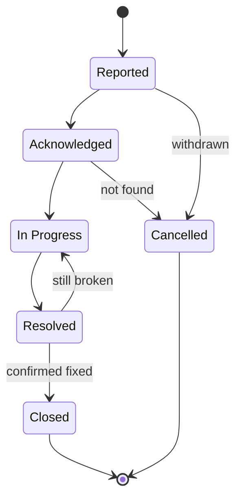

# ResFix — Student Residence Maintenance Reporting System
A Django web application for reporting and tracking maintenance issues in student residences.

**Full-Stack Django Project — Deliverable 1: Use Case** 
**Author:** Ethan Smith 
**Date:** 18 August 2026 
**Version:** 1.0 
**Status:** Awaiting approval

---

## 1. Background and Problem Statement

This use case is based on a problem observed first-hand in a student residence.
Maintenance issues were reported by walking to the reception desk and describing the
problem to a staff member, who wrote it down. This process failed in four ways:

1. **Reception became a bottleneck.** Reports could only be made during office hours,
   and at busy times students queued to report a dripping tap.
2. **Problems went unreported entirely.** Faced with the effort of queuing, students
   frequently decided a problem was not worth reporting — including problems that
   genuinely mattered.
3. **Duplicate reporting wasted staff time.** A single broken light in a shared
   corridor would be reported separately by many residents, each generating a separate
   piece of paper, with no way to tell they were the same fault.
4. **Urgent issues were not distinguishable from routine ones.** A broken ground-floor
   window that would not lock was recorded in the same way as a slow-draining sink.
   The first is a security and safety risk to the whole building; the second is an
   inconvenience.

The fourth failure is the most serious. Unreported or under-prioritised faults in a
residential building are not merely inconvenient — broken locks, faulty electrics and
water damage carry real risk to residents and to the building itself.

ResFix replaces the reception desk process with a web application. Students report
faults directly, at any hour, and follow progress themselves. Maintenance staff work
from a single prioritised queue that makes urgent work visible.

## 2. Business Objectives

| # | Objective | How the system achieves it |
|---|---|---|
| 1 | Remove the reception bottleneck | Students report directly online, 24/7 |
| 2 | Increase reporting rate for minor faults | Reporting takes under a minute, lowering the effort barrier |
| 3 | Surface genuinely urgent work | Priority is derived from objective questions, not self-assessment |
| 4 | Eliminate duplicate reports for shared areas | Residents corroborate an existing report instead of creating a new one |
| 5 | Route work correctly | Structured category and location data make the staff queue sortable |
| 6 | Give residents visibility of progress | Staff updates are published back to the reporter |
| 7 | Create an auditable maintenance record | Every report, update and priority change is stored with a timestamp |

## 3. Residence Structure

Student residences are not a flat list of rooms. Accommodation is organised into
units: a unit may be a single room with one occupant, or a shared flat in which each
resident has a private bed space but the kitchen, lounge and bathroom are shared
between them. Beyond the units are areas used by the whole building.

ResFix models this in four levels:

| Level | Description | Example |
|---|---|---|
| Building | A residence block | Building A |
| Unit | A room or flat within a building | Unit 42 |
| Bed space | One resident's private space within a unit | 42-1, 42-2, 42-3 |
| Common area | A shared space, belonging either to one unit or to the whole building | Unit 42 kitchen; ground floor laundry |

### 3.1 The bed space identifier

The residence already issues each resident an identifier of the form
`<unit>-<occupant>` — a student in the second bed space of unit 42 is 42-2. This
identifier is adopted directly by ResFix, for three reasons:

- It is already familiar to residents and to residence administration.
- It is unique to one person, so it identifies a resident unambiguously. "Room 42"
  does not, if four people live there.
- It gives maintenance staff a precise destination. A fault in 42-2 is in a specific
  private room, not somewhere in a shared flat.

### 3.2 Common areas

A common area belongs either to a single unit or to the building as a whole. A unit
kitchen is shared by that unit's residents only. A laundry room is shared by every
resident of the building. This distinction determines who may see and corroborate a
report, as described in section 6.

## 4. Actors

The system has **two roles** with distinct capabilities and separate dashboards.

### 4.1 Student (standard user)
A resident of the building. Self-registers an account and claims their bed space
during registration. Reports faults, tracks their own reports, and corroborates
reports for shared areas they have access to. Never sees a report made from inside
another student's private bed space.

### 4.2 Maintenance Staff (administrative user)
An employee of the residence. Accounts are created by the system administrator, not
self-registered. Sees every report across every building, adjusts priority, assigns
work, posts updates and resolves reports. Also maintains the residence structure —
buildings, units, bed spaces and common areas — through the administration interface.

## 5. Registration and Bed Space Assignment

Assigning a student to the wrong room would misdirect maintenance staff and, more
seriously, could expose one student's reports to another. Registration is therefore
designed so that an incorrect assignment is difficult to make by accident.

**The student never types a room number.** The residence structure is loaded into the
system in advance by staff. During registration the student makes three dependent
selections — building, then unit, then bed space — each populated from the database.
Free text entry is not offered, so a mistyped room number cannot occur.

**A bed space may be claimed by only one account.** Bed space occupancy is enforced as
unique at the database level. If a student selects a bed space that another account
already holds, registration is refused and the student is directed to reception. This
catches the common case of a student selecting a neighbour's bed space by mistake.

A residual risk remains: a student could select an unoccupied bed space that is not
theirs. Two mitigations are noted — a one-time claim code issued at check-in and
recorded against the bed space (see section 8.2), and the practical backstop that a
technician attending the wrong room will identify the error immediately.

## 6. Report Visibility and Corroboration

### 6.1 Three tiers of visibility

Visibility follows directly from where a fault is located.

| Location of fault | Visible to | May be corroborated by |
|---|---|---|
| A student's bed space | That student and staff only | Nobody |
| A unit common area | The residents of that unit, and staff | Residents of that unit |
| A building common area | All residents of that building, and staff | Residents of that building |

### 6.2 Restriction on private reports

Reports logged against a bed space are **never** visible to any student other than the
reporter.

This is a safety decision, not only a privacy one. A feed that included bed space
faults would publish which rooms currently have a broken lock, a window that will not
close, or a door that does not latch — information that would materially assist anyone
intending to target a room. The restriction is absolute and is not relaxed for
flatmates.

### 6.3 Preventing duplicates

Rather than allowing duplicate reports to be created and then merged by staff, ResFix
prevents duplicates at the point of creation.

When a student begins reporting a fault in a common area, the system first shows the
open reports already logged for the areas that student has access to. If the fault is
already listed, the student selects "I have this problem too" instead of submitting a
new report. Each student may corroborate a given report only once, enforced at the
database level.

The corroboration count is displayed to staff. Where a report accumulates
corroborations beyond a defined threshold, its priority is escalated automatically.
**Corroboration can only raise a priority, never lower one**, so that volume of
reporting can never be used to suppress a safety-critical fault.

There is no mechanism for students to dispute or downvote another student's report. An
unresolved hazard must not be capable of being voted into invisibility. A report may be
withdrawn only by its original reporter, or closed by staff as not found.

## 7. Priority Determination

### 7.1 Design rationale

A conventional design would let the reporter choose a priority from a dropdown. This
was rejected because it fails in both directions: a student may inflate the priority of
a minor fault to jump the queue, and — more dangerously — may under-report a serious
fault because they do not recognise it as serious.

ResFix therefore does not ask the student how urgent the problem is. It asks a short
set of **objective, factual questions**, and derives the priority from the answers.

This has two effects. Inflating priority now requires making a specific factual claim
that a technician will disprove on arrival, which is a meaningfully stronger deterrent
than moving a slider. And a student who does not realise that a burning smell is
serious does not need to — the system escalates on their behalf.

### 7.2 Triage questions

| Question | Effect |
|---|---|
| Is water currently running, leaking or flooding? | Yes → escalate to High |
| Can the affected door or window still lock securely? | No → escalate to Emergency |
| Is there a burning smell, sparks, or visible exposed wiring? | Yes → escalate to Emergency |
| Is the room still usable for sleeping tonight? | No → escalate to High |

### 7.3 Priority levels

| Priority | Target response | Typical example |
|---|---|---|
| Emergency | Immediate | Exposed wiring; external door will not lock |
| High | Same day | Active leak; room uninhabitable |
| Standard | Within 3 working days | Broken appliance; faulty interior light |
| Low | Next scheduled maintenance | Slow-draining sink; loose cupboard handle |

Each category carries a minimum priority. Electrical faults and any fault affecting
building security cannot be recorded below High, regardless of the triage answers.

### 7.4 Staff override

Maintenance staff may raise or lower the priority of any report. The system stores both
the originally derived priority and the current priority, together with the identity of
the staff member who changed it and the time of the change. This override requires no
site visit — it is a single action on the dashboard.

## 8. Scope

### 8.1 In Scope

**A student can:**
- Register an account by selecting their building, unit and bed space, then log in and
  out
- Report a fault, following the three-step flow: where, what, and detail
- Corroborate an existing report for a shared area they have access to
- View a list of their own reports and their current status
- View the full history of staff updates on one of their reports
- Confirm that a resolved fault is genuinely fixed, or return it as still broken
- Withdraw their own report

**Maintenance staff can:**
- Log in to a staff dashboard listing every report
- Filter and sort the queue by priority, status, category, building and corroboration
  count
- Assign a report to themselves
- Raise or lower the priority of a report, with the change attributed and timestamped
- Post an update against a report, visible to the reporter and to anyone who
  corroborated it
- Move a report through the workflow and mark it resolved
- Close a report as not found
- Maintain the residence structure and the category list through the administration
  interface

### 8.2 Out of Scope

Excluded to keep the project deliverable within the available time. Recorded as
possible future enhancements.

- One-time claim codes issued at check-in to verify bed space assignment
- Photograph upload (requires external media storage to survive redeployment)
- Email or SMS notification of status changes
- A third role for a residence manager with oversight and reporting dashboards
- Contractor scheduling, parts ordering and cost tracking
- Statistical reporting on response times and recurring faults

## 9. Reporting Flow

A student reporting a fault answers three questions in sequence.

**Step 1 — Where is the problem?**
- In my own room — the student's bed space, already known to the system
- In a shared space in my unit — offered only to residents of a shared unit
- In a building area — laundry, gym, study centre, corridor, communal bathroom

If a common area is selected, the system displays open reports for that area before
allowing a new one, as described in section 6.3.

**Step 2 — What is the problem?**
The student selects a category (plumbing, electrical, appliance, structural, furniture,
pest, other) and then, where applicable, the specific fixture — offered from a list
filtered by the chosen category and the type of location.

**Step 3 — Describe it.**
A free-text description, followed by the triage questions from section 7.2.

Structured selection in steps 1 and 2 is what makes the staff queue sortable and
routable. The free-text description in step 3 captures what the structured fields do
not anticipate. Both are required.

## 10. Report Workflow

| Status | Meaning |
|---|---|
| Reported | Submitted by a student; no staff member has picked it up |
| Acknowledged | A staff member has assigned the report to themselves |
| In Progress | Work is underway |
| Resolved | Staff consider the work complete; awaiting student confirmation |
| Closed | Student has confirmed the fault is fixed; the report is complete and no longer actionable |
| Cancelled | Withdrawn by the reporter before work began, or closed by staff as not found |

The student confirmation step is deliberate. It prevents a report being marked complete
when the underlying fault persists, and it gives the resident the final say on whether
their problem was actually solved. Where a report has corroborations, confirmation by
the original reporter closes it.

## 11. Use Case Narratives

### UC-01 — Student registers and claims a bed space

- **Actor:** Student
- **Precondition:** The residence structure has been loaded by staff
- **Main flow:**
  1. Student opens the registration page and enters account details
  2. Student selects their building; the system offers the units in that building
  3. Student selects their unit; the system offers the unoccupied bed spaces in it
  4. Student selects their bed space and submits
  5. System creates the account and links it to that bed space
- **Alternate flow:** If the selected bed space has been claimed by another account,
  registration is refused with a message directing the student to reception
- **Postcondition:** The student is associated with exactly one bed space

### UC-02 — Student reports a fault in their own room

- **Actor:** Student
- **Precondition:** Student is logged in and holds a bed space
- **Main flow:**
  1. Student selects "Report a problem" and chooses "in my own room"
  2. Student selects a category and, where offered, the specific fixture
  3. Student describes the fault and answers the triage questions
  4. System derives a priority from the answers and the category minimum
  5. System creates the report with status *Reported* and displays it
- **Postcondition:** Report exists, is visible to its reporter and to staff only, and
  appears in the staff queue positioned by its derived priority

### UC-03 — Student corroborates an existing common area report

- **Actor:** Student
- **Precondition:** Student is logged in; an open report exists for a common area the
  student has access to
- **Main flow:**
  1. Student selects "Report a problem" and chooses a common area
  2. System displays open reports for the areas that student may see
  3. Student recognises the fault and selects "I have this problem too"
  4. System records the corroboration and increments the count
  5. If the count crosses the escalation threshold, the priority is raised
- **Alternate flow:** If the fault is not listed, the student proceeds to submit a new
  report as in UC-02
- **Postcondition:** No duplicate report is created

### UC-04 — Staff triage and progress a report

- **Actor:** Maintenance staff
- **Precondition:** Staff member is logged in; at least one unassigned report exists
- **Main flow:**
  1. Staff member opens the dashboard, sorted by priority
  2. Staff member opens a report and assigns it to themselves; status becomes
     *Acknowledged*
  3. Staff member adjusts the priority if the derived value is wrong; the change is
     recorded against their name and the time
  4. Staff member posts an update describing the intended work
  5. Staff member sets the status to *In Progress*
- **Postcondition:** Report is owned; the reporter and any corroborating students can
  immediately see the status and the update

### UC-05 — Resolution and student confirmation

- **Actor:** Maintenance staff, then Student
- **Precondition:** Report is *In Progress*
- **Main flow:**
  1. Staff member posts a final update and sets the status to *Resolved*
  2. Student sees the resolved report and confirms the fault is fixed
  3. System sets the status to *Closed*
- **Alternate flow:** Student indicates the fault persists; the report returns to
  *In Progress* and reappears in the staff queue
- **Postcondition:** Report is closed only with the resident's agreement

### UC-06 — Access control

- **Actor:** Student
- **Main flow:** A student attempts to open a report logged against another student's
  bed space by altering the URL
- **Postcondition:** The system returns a 404 error and discloses nothing about the
  report or its existence

## 12. Role Permission Matrix

| Action | Student | Maintenance Staff |
|---|:---:|:---:|
| Self-register and claim a bed space | Yes | No |
| Report a fault | Yes | No |
| View own reports | Yes | Yes (all reports) |
| View reports for accessible common areas | Yes | Yes (all areas) |
| View another student's bed space report | No | Yes |
| Corroborate a common area report | Yes | No |
| Change priority | No | Yes |
| Assign a report | No | Yes |
| Post an update | No | Yes |
| Change status | Confirm / reopen only | Yes |
| Withdraw a report | Own only | Yes (as not found) |
| Maintain residence structure | No | Yes |

## 13. Success Criteria

The project will be considered successful when:

1. A student can register, claim a bed space, report a fault, follow it to resolution
   and confirm the fix without assistance.
2. A student cannot register against a bed space that is already occupied, and cannot
   enter a room identifier by free text at any point.
3. A fault reported with a hazard indicator is automatically prioritised above a
   routine fault, without the student having assessed its urgency.
4. A staff member can move a report through every status in the workflow and can
   override a derived priority, with the change attributed and timestamped.
5. Multiple students reporting the same common area fault produce one report with
   multiple corroborations, not multiple reports.
6. No report logged against a bed space is visible to any student other than its
   reporter, by any route, including by editing the URL.
7. A report logged against a unit common area is visible to that unit's residents and
   to no other student.
8. An anonymous visitor cannot reach any report data.
9. The system is deployed and reachable over the internet.
